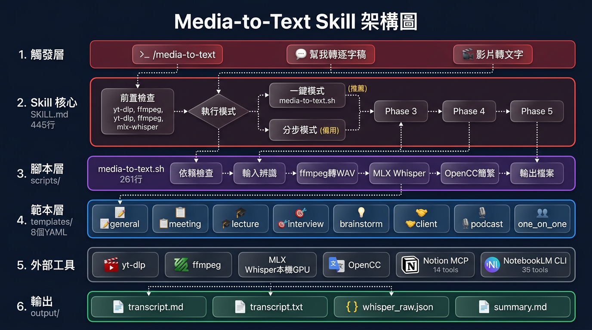

<div align="center">

# 🎙️ Media-to-Text Skill

**將任何影片或音訊轉換為精準逐字稿 + 結構化摘要**

*使用 MLX Whisper 在 Apple Silicon 本機 GPU 上執行——快速、免費、完全離線。支援多語言偵測與雙語輸出。*

[](https://www.python.org/)
[](./LICENSE)
[](https://support.apple.com/zh-tw/116943)
[](https://claude.ai/claude-code)
[](https://github.com/ml-explore/mlx-examples)
[](https://github.com/BYVoid/OpenCC)

[English](./README.md)


</div>

---

## ✨ 功能特色

| | 功能 | 說明 |
|---|------|------|
| 🎬 | **多來源輸入** | YouTube URL、本地影片（mp4/mkv/avi/mov）、本地音訊（mp3/m4a/wav/flac） |
| ⚡ | **本機 GPU 轉錄** | MLX Whisper large-v3-turbo，M4 Pro 上約 20 倍即時速度 |
| 🌐 | **多語言支援** | 自動偵測音訊語言，用原始語言轉錄 |
| 🔄 | **雙語輸出** | 原文逐字稿 + 繁體中文翻譯版（透過 Claude Agent 翻譯） |
| 🇹🇼 | **繁體中文最佳化** | OpenCC s2twp 轉換，使用台灣慣用詞（記憶體、程式、影片） |
| 📋 | **8 種場景範本** | 自動偵測或手動選擇——會議、面試、講座、腦力激盪、客戶訪談、播客、一對一、通用 |
| 🤖 | **Claude Code Skill** | 完整整合，支援 `/media-to-text` 指令 |
| 📤 | **可選發布** | 透過 MCP 發布至 Notion 資料庫 + NotebookLM 筆記本 |

## 📦 環境需求

- macOS Apple Silicon（M1/M2/M3/M4）
- 16GB RAM 以上（建議 24GB+）
- Python 3.10+
- [yt-dlp](https://github.com/yt-dlp/yt-dlp) 和 [ffmpeg](https://ffmpeg.org/)

## 🚀 快速開始

### 安裝

```bash
git clone https://github.com/ci-yang/media-to-text-skill.git
cd media-to-text-skill
bash install.sh
```

> **注意：** 依賴安裝到 `~/.claude/.venv`（全域虛擬環境），這樣 skill 可以在任何專案目錄下使用。Whisper 模型（~1.5 GB）快取在 `~/.cache/huggingface/hub/`。

### 作為 Claude Code Skill 使用（推薦）

複製到你的專案 skill 目錄：

```bash
cp -r media-to-text-skill /path/to/your-project/.claude/skills/media-to-text
```

在 Claude Code 中：

```
/media-to-text https://youtube.com/watch?v=xxx
/media-to-text ~/recordings/meeting.m4a --template meeting
/media-to-text https://youtube.com/watch?v=xxx --bilingual
/media-to-text ~/Videos/lecture.mp4 --lang en --bilingual --template lecture
```

### 作為獨立腳本使用

```bash
bash scripts/media-to-text.sh https://youtube.com/watch?v=xxx
bash scripts/media-to-text.sh ~/meeting.m4a ./output/my-meeting
```

## 🌐 多語言與雙語輸出

### 運作原理

1. **自動偵測** — Whisper 分析前 30 秒音訊片段辨識語言
2. **原文轉錄** — 用偵測到的語言轉錄（英文音訊 → 英文逐字稿）
3. **可選翻譯** — Claude Agent 翻譯為繁體中文（品質遠優於 Whisper 跨語言轉錄）

### 使用範例

| 輸入 | `--bilingual` | 輸出 |
|------|:------------:|------|
| 中文音訊 | 否 | `transcript.md`（繁體中文） |
| 英文音訊 | 否 | `transcript_en.md`（純英文） |
| 英文音訊 | 是 | `transcript_en.md` + `transcript.md`（中文翻譯） |
| 日文音訊 | 是 | `transcript_ja.md` + `transcript.md`（中文翻譯） |

### 為什麼不用 Whisper 跨語言轉錄？

對英文音訊設 `language="zh"` 會產出大量亂碼。正確做法：用原始語言轉錄，再用 Claude Agent 翻譯。

## 📑 範本說明

| `--template` | 名稱 | 適用場景 | 產出重點 |
|:------------:|------|---------|---------|
| `general` | 📝 通用摘要 | 不確定類型 | 標題、TLDR、重點、摘要 |
| `meeting` | 📋 會議記錄 | 團隊會議 | 與會者、議程、決議、待辦 |
| `interview` | 🎯 面試摘要 | 求職面試 | 問答記錄、能力評估、建議 |
| `lecture` | 🎓 講座筆記 | 演講/課堂 | 大綱、概念、引言、收穫 |
| `brainstorm` | 💡 腦力激盪 | 創意會議 | 點子分類、精選、停車場 |
| `client` | 🤝 客戶訪談 | 業務拜訪 | 痛點、需求、商機、行動 |
| `podcast` | 🎙️ 播客/訪談 | 節目/對談 | 見解、金句、三版本摘要 |
| `one_on_one` | 👥 一對一會議 | 主管面談 | 進度、障礙、回饋、目標 |

### 自動偵測原理

Skill 讀取逐字稿前 500 字，比對各範本的關鍵詞：
- 出現「議程、決議、待辦」→ 會議記錄
- 出現「面試、候選人」→ 面試摘要
- 出現「課程、教授」→ 講座筆記
- 都沒命中 → 通用摘要

## 🏗️ 架構

<div align="center">

</div>

### 運作方式

```
📥 輸入            🔄 處理                 📄 輸出              📤 發布
─────────         ──────────────         ─────────           ─────────
YouTube URL  ──→  yt-dlp 擷取       ──→  transcript.md  ──→  Notion
本地影片      ──→  ffmpeg → 16kHz WAV ─→  transcript.txt      NotebookLM
本地音訊      ──→  MLX Whisper GPU   ──→  whisper_raw.json
                   語言偵測          ──→  transcript_{lang}.*
                   OpenCC s2twp      ──→  summary.md
                   Claude Agent      ──→  （雙語翻譯）
                   Claude + 範本
```

### 🧠 Whisper 模型

| | 說明 |
|---|------|
| **模型** | [`mlx-community/whisper-large-v3-turbo`](https://huggingface.co/mlx-community/whisper-large-v3-turbo) |
| **大小** | ~1.5 GB |
| **框架** | [MLX](https://github.com/ml-explore/mlx) — Apple 為 Apple Silicon 打造的 ML 框架 |
| **存放位置** | `~/.cache/huggingface/hub/`（首次執行自動下載） |
| **費用** | **完全免費** — 全程在本機 GPU 執行，不需要 API key |
| **速度** | M4 Pro 上約 20 倍即時速度（1 小時音訊 ≈ 3 分鐘） |

> **首次執行提醒：** 模型（~1.5 GB）會在第一次使用時自動從 Hugging Face 下載，之後直接使用快取版本。

<details>
<summary><b>可替換模型</b></summary>

可在 `scripts/media-to-text.sh` 中修改模型：

| 模型 | 大小 | 速度 | 精確度 | 適用場景 |
|------|------|------|--------|---------|
| `whisper-large-v3-turbo` | 1.5 GB | ⚡ 快 | ✅ 高 | **預設 — 最佳平衡** |
| `whisper-large-v3` | 3.1 GB | 🐢 較慢 | ✅✅ 最高 | 需要最高精確度 |
| `whisper-base` | 142 MB | ⚡⚡ 最快 | ⚠️ 較低 | 記憶體不足 / 快速草稿 |

</details>

### 🎯 Whisper 精準度的秘密

| 技巧 | 解決什麼問題 | 影響程度 |
|------|------------|:-------:|
| `language` 匹配實際語言 | 防止跨語言亂碼 | ⭐⭐⭐⭐⭐ |
| `condition_on_previous_text=False` | 防止幻覺/重複 | ⭐⭐⭐⭐⭐ |
| `initial_prompt` 語言適配 | 引導術語偏好 | ⭐⭐ |
| large-v3-turbo + MLX | 速度與精度兼顧 | ⭐⭐⭐⭐ |
| OpenCC s2twp | 簡→繁台灣用語 | ⭐⭐⭐ |
| Claude Agent 翻譯 | 高品質跨語言翻譯 | ⭐⭐⭐⭐ |

### 🔧 Python 環境

| | 路徑 |
|---|------|
| **虛擬環境** | `~/.claude/.venv/` |
| **Python 執行檔** | `~/.claude/.venv/bin/python` |
| **Whisper 模型快取** | `~/.cache/huggingface/hub/` |

> 使用 `~/.claude/.venv` 全域虛擬環境，讓 skill 可在任何專案目錄下使用，無需每個專案單獨安裝。

## 📂 輸出檔案

每次執行產出在 `./output/{日期}_{標題}/`：

```
output/2026-03-16_團隊週會/
├── transcript.md        # 含時間戳的逐字稿（繁體中文）
├── transcript.txt       # 純文字逐字稿（給 LLM 摘要用）
├── transcript_{lang}.md # 原文逐字稿（若非中文音訊）
├── transcript_{lang}.txt# 原文純文字（若非中文音訊）
├── whisper_raw.json     # Whisper 完整輸出備份
├── summary.md           # 結構化摘要（繁體中文）
└── summary_{lang}.md    # 原文摘要（若雙語模式）
```

## ⚡ 效能參考

MacBook Pro M4 Pro 24GB 實測：

| 音訊長度 | 轉錄時間 | 速度倍率 |
|:-------:|:-------:|:-------:|
| 44 分鐘 | ~2 分鐘 | **~21x** |
| 1 小時 | ~3 分鐘 | **~20x** |

## 🔧 疑難排解

<details>
<summary><b>常見問題</b></summary>

| 問題 | 解法 |
|------|------|
| yt-dlp 403 Forbidden | `brew upgrade yt-dlp`（版本太舊） |
| Whisper 記憶體不足 | 改用較小模型 `whisper-base` |
| pip install 失敗 (PEP 668) | 使用全域 venv `~/.claude/.venv` — 執行 `bash install.sh` |
| 輸出出現簡體字 | 確認 OpenCC 有安裝且使用 s2twp |
| 出現重複/無意義文字 | 確認 `condition_on_previous_text=False` |
| 找不到 Python/mlx_whisper | 確認 `~/.claude/.venv/bin/python` 存在 — 執行 `bash install.sh` |
| 英文影片產出亂碼中文 | 不要對非中文音訊使用 `language="zh"` — 改用 `--bilingual` |

</details>

## 📄 授權

[MIT](./LICENSE) — 個人與商業用途皆可免費使用。

---

<div align="center">

Made with ❤️ for the Traditional Chinese community

**[回報問題](https://github.com/ci-yang/media-to-text-skill/issues)** · **[功能建議](https://github.com/ci-yang/media-to-text-skill/issues)**

</div>
