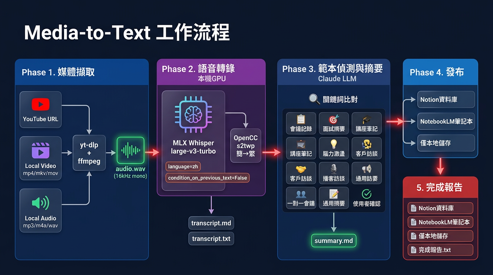

# Media-to-Text Skill

> 將任何影片或音訊轉換為精準繁體中文逐字稿 + 結構化摘要，使用 MLX Whisper 在 Apple Silicon 本機 GPU 上執行。

[English](./README.md)



## 功能特色

- **多來源輸入**：YouTube URL、本地影片（mp4/mkv/avi/mov）、本地音訊（mp3/m4a/wav/flac）
- **本機 GPU 轉錄**：MLX Whisper large-v3-turbo，M4 Pro 上約 20 倍即時速度
- **繁體中文最佳化**：OpenCC s2twp 轉換，使用台灣慣用詞（記憶體、程式、影片）
- **8 種場景範本**：自動偵測或手動選擇——會議、面試、講座、腦力激盪、客戶訪談、播客、一對一、通用
- **Claude Code Skill**：完整整合為 Claude Code skill，支援 `/media-to-text` 指令
- **可選發布**：透過 MCP 發布至 Notion 資料庫 + NotebookLM 筆記本

## 環境需求

- macOS Apple Silicon（M1/M2/M3/M4）
- 16GB RAM 以上（建議 24GB+）
- Python 3.10+
- [yt-dlp](https://github.com/yt-dlp/yt-dlp) 和 [ffmpeg](https://ffmpeg.org/)

## 快速開始

### 安裝

```bash
git clone https://github.com/ci-yang/media-to-text-skill.git
cd media-to-text-skill
bash install.sh
```

### 作為 Claude Code Skill 使用（推薦）

複製到你的專案 skill 目錄：

```bash
cp -r media-to-text-skill /path/to/your-project/.claude/skills/media-to-text
```

在 Claude Code 中：

```
/media-to-text https://youtube.com/watch?v=xxx
/media-to-text ~/recordings/meeting.m4a --template meeting
/media-to-text ~/Videos/lecture.mp4 --template lecture --publish notion
```

### 作為獨立腳本使用

```bash
source .venv/bin/activate
bash scripts/media-to-text.sh https://youtube.com/watch?v=xxx
bash scripts/media-to-text.sh ~/meeting.m4a ./output/my-meeting
```

## 範本說明

| `--template` | 名稱 | 適用場景 | 產出重點 |
|-------------|------|---------|---------|
| `general` | 📝 通用摘要 | 不確定類型 | 標題、TLDR、重點、摘要 |
| `meeting` | 📋 會議記錄 | 團隊會議 | 與會者、議程、決議、待辦 |
| `interview` | 🎯 面試摘要 | 求職面試 | 問答記錄、能力評估、建議 |
| `lecture` | 🎓 講座筆記 | 演講/課堂 | 大綱、概念、引言、收穫 |
| `brainstorm` | 💡 腦力激盪 | 創意會議 | 點子分類、精選、停車場 |
| `client` | 🤝 客戶訪談 | 業務拜訪 | 痛點、需求、商機、行動 |
| `podcast` | 🎙️ 播客/訪談 | 節目/對談 | 見解、金句、三版本摘要 |
| `one_on_one` | 👥 一對一會議 | 主管面談 | 進度、障礙、回饋、目標 |

### 自動偵測原理

Skill 讀取逐字稿前 500 字，比對各範本的關鍵詞：
- 出現「議程、決議、待辦」→ 會議記錄
- 出現「面試、候選人」→ 面試摘要
- 出現「課程、教授」→ 講座筆記
- 都沒命中 → 通用摘要

## 架構


### 運作方式

1. **擷取**：yt-dlp（URL）或 ffmpeg（本地檔案）→ 16kHz mono WAV
2. **轉錄**：MLX Whisper 本機 GPU → OpenCC s2twp 簡繁轉換
3. **摘要**：Claude LLM 依範本逐 section 生成
4. **發布**（可選）：Notion MCP + NotebookLM CLI

### Whisper 精準度的秘密

| 技巧 | 解決什麼問題 | 影響程度 |
|------|------------|---------|
| `language="zh"` | 防止語言誤判 | ⭐⭐⭐ |
| `condition_on_previous_text=False` | 防止幻覺/重複 | ⭐⭐⭐⭐⭐ |
| `initial_prompt` 領域提示 | 引導術語偏好 | ⭐⭐ |
| large-v3-turbo + MLX | 速度與精度兼顧 | ⭐⭐⭐⭐ |
| OpenCC s2twp | 簡→繁台灣用語 | ⭐⭐⭐ |

## 輸出檔案

每次執行產出在 `./output/{日期}_{標題}/`：

| 檔案 | 說明 |
|------|------|
| `transcript.md` | 含時間戳的逐字稿 |
| `transcript.txt` | 純文字逐字稿（給 LLM 摘要用） |
| `whisper_raw.json` | Whisper 完整輸出備份 |
| `summary.md` | 結構化摘要 |

## 效能參考

MacBook Pro M4 Pro 24GB 實測：

| 音訊長度 | 轉錄時間 | 速度倍率 |
|---------|---------|---------|
| 44 分鐘 | ~2 分鐘 | ~21x |
| 1 小時 | ~3 分鐘 | ~20x |

## 疑難排解

| 問題 | 解法 |
|------|------|
| yt-dlp 403 Forbidden | `brew upgrade yt-dlp`（版本太舊） |
| Whisper 記憶體不足 | 改用較小模型 `whisper-base` |
| pip install 失敗 (PEP 668) | 使用虛擬環境 `python3 -m venv .venv` |
| 輸出出現簡體字 | 確認 OpenCC 有安裝且使用 s2twp |
| 出現重複/無意義文字 | 確認 `condition_on_previous_text=False` |

## 授權

[MIT](./LICENSE)
