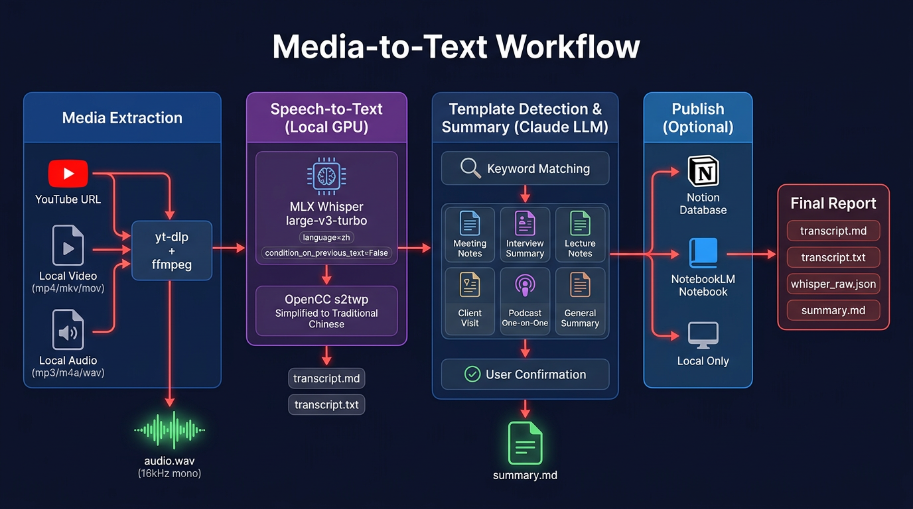
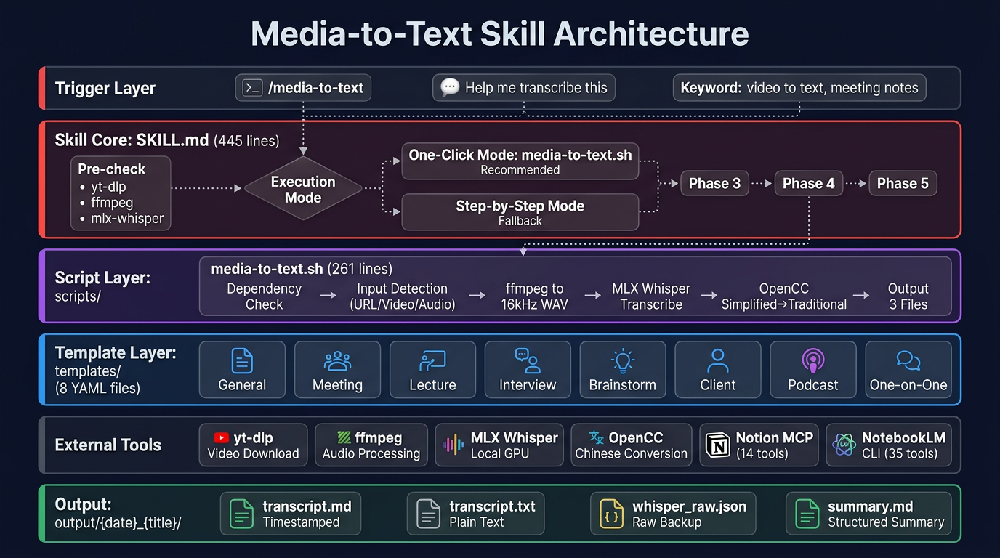

# Media-to-Text Skill

> Convert any video or audio into accurate Traditional Chinese transcripts + structured summaries, powered by MLX Whisper on Apple Silicon.

[繁體中文說明](./README-zh-TW.md)



## Features

- **Multi-source input**: YouTube URLs, local video (mp4/mkv/avi/mov), local audio (mp3/m4a/wav/flac)
- **Local GPU transcription**: MLX Whisper large-v3-turbo on Apple Silicon (~20x realtime on M4 Pro)
- **Traditional Chinese optimized**: OpenCC s2twp conversion with Taiwan-specific terminology
- **8 scene templates**: Auto-detect or manually select — meeting, interview, lecture, brainstorm, client visit, podcast, one-on-one, general
- **Claude Code Skill**: Full integration as a Claude Code skill with `/media-to-text` command
- **Optional publishing**: Notion database + NotebookLM notebook via MCP

## Requirements

- macOS with Apple Silicon (M1/M2/M3/M4)
- 16GB RAM minimum (24GB+ recommended)
- Python 3.10+
- [yt-dlp](https://github.com/yt-dlp/yt-dlp) and [ffmpeg](https://ffmpeg.org/)

## Quick Start

### Installation

```bash
git clone https://github.com/ci-yang/media-to-text-skill.git
cd media-to-text-skill
bash install.sh
```

### As Claude Code Skill (Recommended)

Copy into your project's skill directory:

```bash
cp -r media-to-text-skill /path/to/your-project/.claude/skills/media-to-text
```

Then in Claude Code:

```
/media-to-text https://youtube.com/watch?v=xxx
/media-to-text ~/recordings/meeting.m4a --template meeting
```

### As Standalone Script

```bash
source .venv/bin/activate
bash scripts/media-to-text.sh https://youtube.com/watch?v=xxx
bash scripts/media-to-text.sh ~/meeting.m4a ./output/my-meeting
```

## Templates

| Template | Name | Use Case |
|----------|------|----------|
| `general` | 📝 General Summary | Default when type is unclear |
| `meeting` | 📋 Meeting Notes | Team meetings, standups |
| `interview` | 🎯 Interview Summary | Job interviews, evaluations |
| `lecture` | 🎓 Lecture Notes | Talks, classes, tutorials |
| `brainstorm` | 💡 Brainstorm | Creative sessions, ideation |
| `client` | 🤝 Client Visit | Sales calls, requirements |
| `podcast` | 🎙️ Podcast/Interview | Shows, discussions |
| `one_on_one` | 👥 One-on-One | Manager 1:1s, check-ins |

## Architecture



### How It Works

1. **Extract**: yt-dlp (URLs) or ffmpeg (local files) → 16kHz mono WAV
2. **Transcribe**: MLX Whisper on local GPU → OpenCC s2twp for Traditional Chinese
3. **Summarize**: Claude LLM with template-based structured generation
4. **Publish** (optional): Notion MCP + NotebookLM CLI

### Key Parameters

| Parameter | Value | Why |
|-----------|-------|-----|
| `language` | `"zh"` | Force Chinese recognition, prevent misdetection |
| `condition_on_previous_text` | `False` | **Prevent hallucination** — stops error accumulation |
| `initial_prompt` | Traditional Chinese hint | Guide model toward Traditional Chinese + English terms |
| OpenCC profile | `s2twp` | Simplified → Traditional with Taiwan vocabulary |

## Output

Each run produces in `./output/{date}_{title}/`:

| File | Description |
|------|-------------|
| `transcript.md` | Timestamped transcript |
| `transcript.txt` | Plain text (for LLM summarization) |
| `whisper_raw.json` | Raw Whisper output |
| `summary.md` | Structured summary |

## Troubleshooting

| Problem | Solution |
|---------|----------|
| yt-dlp 403 Forbidden | `brew upgrade yt-dlp` (version too old) |
| Whisper out of memory | Use smaller model: change to `whisper-base` |
| pip install fails (PEP 668) | Use venv: `python3 -m venv .venv` |
| Simplified Chinese in output | Ensure OpenCC installed with `s2twp` profile |
| Repeated/hallucinated text | Verify `condition_on_previous_text=False` |

## License

[MIT](./LICENSE)
